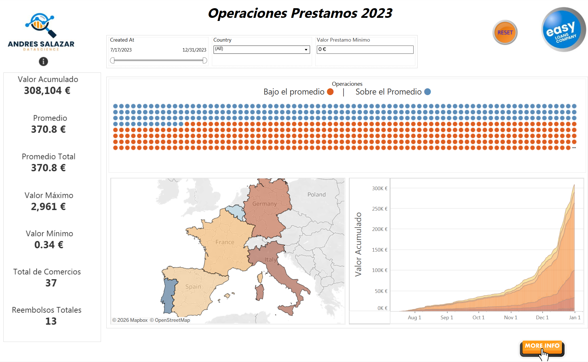
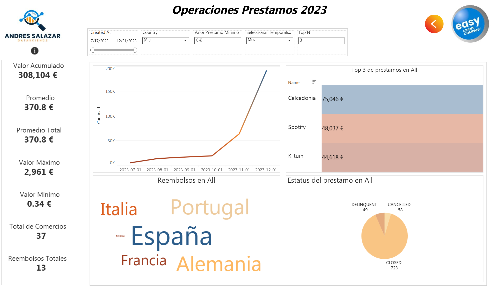

# Consumer Strategic Lending Insights: A Business Case Study (2023)

Strategic analysis of a consumer credit portfolio for the 2023 fiscal year. This project is a practical application of data analytics and visualization techniques to drive data-informed decision-making in retail lending.

## 🎯 Project Overview
This case study simulates a financial environment ("Easyloans") to transform raw transactional data into actionable business intelligence. The analysis focuses on portfolio health, merchant performance, and geographic trends across European markets.

## 📊 Key Results & KPIs (FY2023)
* **Total Accumulated Value**: 308,104 €.
* **Mean Exposure per Operation**: 370.8 € (Average ticket).
* **Volume Extremes**: 2,961 € (Max) vs 0.34 € (Min).
* **Portfolio Health (Current Status)**: 
    * **Closed**: 723
    * **Cancelled**: 58
    * **Delinquent**: 49.
* **Top 3 Merchants by Volume**: Calzedonia (75,046 €), Spotify (48,037 €), and K-tuin (44,618 €).
* **Geographic Scope**: Spain, France, Italy, Portugal, Germany, and Belgium.

### 💡 Strategic Insight
Data reveals a significant surge in lending volume during Q4 (November-December), correlating with seasonal retail peaks. This highlights the need for increased liquidity and risk monitoring during year-end operations.

## 📋 Data Architecture & Relational Schema
The analysis integrates a relational model to simulate real-world database environments:

* **Table: Orders**: Core transaction logs (`order_id`, `created_at`, `status`, `amount`, `merchant_id`, `country`).
* **Table: Refunds**: Capital return tracking (`order_id`, `refunded_at`, `amount`).
* **Table: Merchant**: Business entity metadata (`merchant_id`, `name`).

## 🛠️ Methodology
1. **Exploratory Data Analysis (EDA)**: Validated distributions and identified financial outliers.
2. **KPI Engineering**: Designed custom metrics for exposure and delinquency tracking.
3. **Data Storytelling**: Developed a dual-view interactive dashboard in Tableau for executive-level reporting.

## 🖥️ Interactive Dashboard
> **[👉 View Interactive Dashboard on Tableau Public](https://public.tableau.com/app/profile/andres.salazar.a/viz/consumer-strategic-lending-insights-2023/PanelPrincipalAS)**

---
*Note: This repository contains the analysis and visualization framework. The underlying proprietary dataset is not included.*
